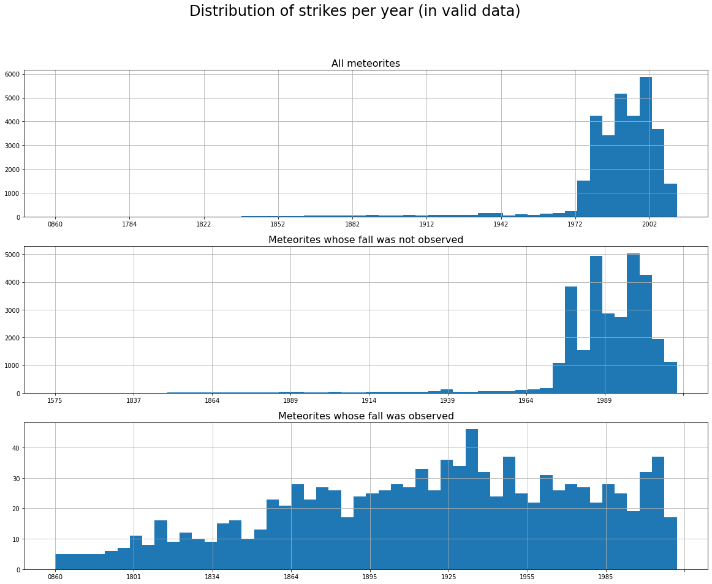
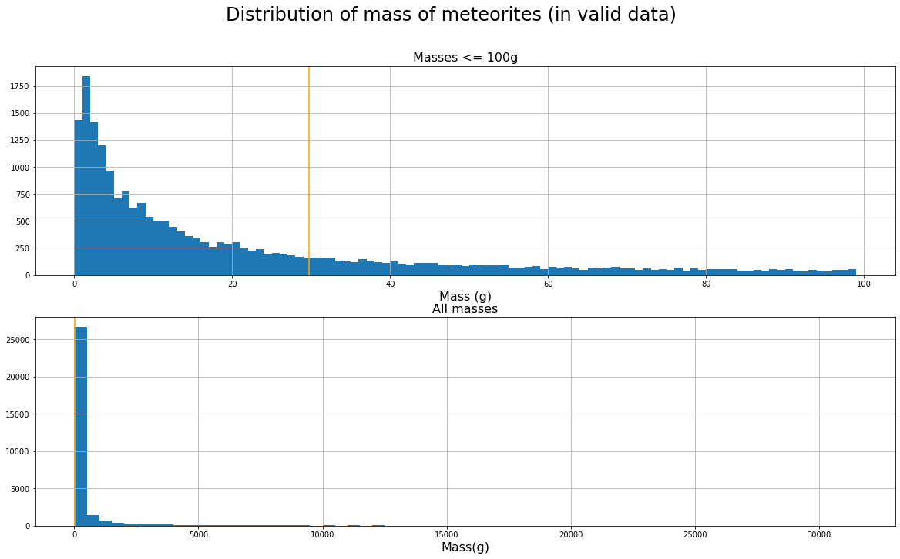

# Milestone 1

## 2.1 Datasets

For our project we decided to go with multiple datasets that are related with the topic of natural catastrophes:

- [https://www.kaggle.com/usgs/earthquake-database#database.csv](https://www.kaggle.com/usgs/earthquake-database#database.csv) A dataset of 23412 accounts of earthquakes and explosions recorded over the years 1965 to 2016. 23232 of these data points are earthquakes, so we might only keep the earthquakes. The data contains time, date, location in latitude and longitude, as well as some data on the magnitude and the location of the epicentre.
- [https://www.kaggle.com/nasa/meteorite-landings](https://www.kaggle.com/nasa/meteorite-landings) A dataset of 45716 meteorites that have struck Earth. Entries contain name (usually the name of the area that was struck), id (probably from a relational DB), whether the meteorite has been highly degraded by weather or not, class, mass in grams, whether the fall was observed or not, the year the meteorite fell or was found, and the fall’s geographic coordinates (lat-lon).
- [https://data.world/makeovermonday/2018w28-volcano-eruptions](https://data.world/makeovermonday/2018w28-volcano-eruptions) A dataset consisting of 18’668 Volcanoes with their latitude, longitude as well as their region, names, elevations and some properties. One of which is the last eruption, given to 60% of the data, the oldest happened 12’470 years ago.

Having studied these datasets we assessed that the data is mostly clean with little to no corrupted data points.

Some columns regarding the location of the epicentre of earthquakes are mostly empty, but we will mostly concentrate on the magnitude data which is more or less complete.

About 31% of the meteorite data has invalid date, location or mass data. This leaves us with 31911 complete data points. Furthermore, depending on the type of visualization and what data it needs, we could use some of the data deemed invalid.

The volcanoes data was very clean with some missing entries in the volcano type, rock type, tectonic setting and last eruption. Since the median age of the known eruptions is 114 years ago, we could easily focus on the most recent data for eruption plotting.

## 2.2 Problematic

With our visualization we hope to assess a timelapse of all of these events in addition to locating “hot spots” of our planet, where these events occur more often than in other places. A detailed look per region or a sort of a leaderboard per country would also be interesting to visualize in order to compare statistics of different sub-regions.

The project is mainly aimed at enthusiasts of earthquakes, volcanoes and meteor landings and could be used for international committees to understand which countries are in need of reserve funds to handle these sort of catastrophes. 

## 2.3 Exploratory Data Analysis

### 2.3.1 Earthquakes and Explosions

As mentioned previously, this dataset mainly contains Earthquakes (99.23% of the dataset). We show the distribution of the other types contained in the dataset in *Fig. 1*:

*Fig. 1: Other than Earthquakes, the dataset contains 175 accounts of Nuclear Explosions, 4 accounts of Explosions and 1 event of a Rock Burst which happened in 2010 in the Indian Ocean.*

*Fig. 2* shows the distribution of the Earthquake Magnitudes:

*Fig. 2*

Finally, in *Fig. 3* we plot the number of occurrences of earthquakes per year:

*Fig. 3*

### 2.3.2 Meteorites

In *Fig. 4*, we see that out of the 290 meteorite classes present in the valid data, only 6 of them include more than 1000 data points: L6, H5, H4, H6, L5, and LL5. Although we want to map each class to more easy to understand categories (e.g. composition), the distribution of data points within them may well be just as irregular.

*Fig. 4*

In *Fig. 5*, we see the strike distribution over time is also very irregular, with most data points lying between 1972 and 2013, and spanning from 860 CE to 2013 CE. This may be due to more measurements and deliberate observations being done in that era, compared to more ancient times, as observed falls seem to be more spread out over time.

*Fig. 5*

In *Fig. 6*, we see recorded meteorite masses range from 0.01g to 60,000 kg, with a median at ~30g (orange line). We can see a large majority of all meteorites are very light.

*Fig. 6*

Finally, we notice very few meteorite falls were actually witnessed (only ~3%, 1064 data points) and only 3 were reported to be in “relict” state.

*No plot included here as the differences are too significant to show anything interesting.*

### 2.3.2 Volcanoes

As we can see in *Fig. 7*, the distribution of the last known eruptions are really concentrated in the past 50 years or so with a large amount in the last 5 years from 2018 (when the dataset was created).

*Fig. 7*

The elevations (given in meters with respect to sea level) lie between -5700 and 6879 meters and the average height is 1688.

*Fig. 8*

As we can see in *Fig. 8*, there is a close to normal distribution, with a slow decay and a second ‘hop’ at around 5’800 meters.

As for the primary volcano type, the dominant rock type and the tectonic settings, we see in *Fig. 9* there are only 1367 volcanoes that have all of these values defined.

There are 33 types of volcano types. They express the nature of the volcano (the form or the surroundings). There are 11 rock types and 10 tectonic settings. The rock types distribution is shown in the next figure, where we can see that *basalt / picro-basalt* and *andesite / basaltic andesite* are the most common.

*Fig. 9*

The tectonic settings can be regrouped into 3 categories: *Rift zone*, *Intraplate*, and *Subduction* zone. The distribution is given in *Fig. 10*.

*Fig. 10*

All these categories can be useful to identify some correlation between them.

## 2.4 Related Work

In our knowledge we are the first to combine these datasets together. These datasets are mostly used for machine learning algorithms, thus have little to no data analysis or interactive visualizations of the data. Among plotting the data of different types of natural manifestations, we also want to include a timelapse of the events across time, and giving the user the opportunity to notice patterns in the data by this means.

- [https://maps.disasters.nasa.gov/arcgis/apps/sites/#/home/pages/volcanoes](https://maps.disasters.nasa.gov/arcgis/apps/sites/#/home/pages/volcanoes) This link goes to the official NASA page on natural catastrophe studies (NASA Disaster Mapping Portal). A world map is presented with all their volcanoes data with some additional information
- [http://www.princeton.edu/~efeibush/earthquakes/](http://www.princeton.edu/~efeibush/earthquakes/) A non interactive visualization of earthquakes that shows the magnitude and ignores the dates. Showing the magnitude as a column on the z-axis is an intriguing idea that we might adapt in our visualization.
- [https://www.youtube.com/watch?v=ZqI2glLK8V4](https://www.youtube.com/watch?v=ZqI2glLK8V4) A video showing a time lapse of earthquakes illustrates well what we could accomplish with the event dates. 
- [https://www.youtube.com/watch?v=LLCF7vPanrY](https://www.youtube.com/watch?v=LLCF7vPanrY) A timelapse of a geographical representation of nuclear testing around the Earth.
- [http://bolid.es/](http://bolid.es/) A timelapse of witnessed meteorite falls from 860 until 2014, with interesting dual mass-count representation.