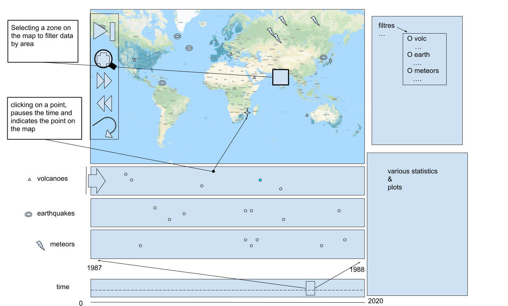

# Milestone 2

## 3.1 Sketches



- Map
  - Plot current events (volcano eruptions, meteorites, earthquakes) on their location on the map
  - When new point are added, clear distinction + visual/audio effect depending on type
  - Switch to different map projections in drop-down menu (settings)
  - Switch from point map to heat map (settings)
  - 2 kinds of selector: hand mouse to move around and brush to select area (drop left)
  - Brush to select region on map (visual display of what is selected)
  - Brush can be zoomed in with lense button
  - Possibility of multiple brushes
  - Drop down panel to filter elements
- Timelapse
  - Plot events displayed on map (volcano eruptions, meteorites, earthquakes) on separate graphs with specific y-axis
  - Display what is in brush (on map) and what isn’t differently
  - Drop right menus to select y axis with predefined column values
- Time window
  - Cursor to select time lapse window start and end. Window can be enlarged or shortened 
- Interactions
  - Time stop/play/replay/speed up/speed down with hover on map (left)
  - Elements arrive in the map at the same time they arrive on the rolls and disappear at the same time
  - Timeline and map: when hovering or clicking element on one visualization, also selects same element on the other + gives specific information
  - Various statistics and plots of data, regarding the selected brush in the current time window
- Statistics for each event type
  - Number of selected events
  - Oldest and newest event dates
  - Possibility to select attributes and plot Least Squared with respect to them and draw the regression while showing the determination coefficient and p-value

## 3.2 List of Tools

- Data Analysis (preprocessing)
  - Python
- Data Manipulation (online processing)
  - Lodash
- All visualizations
  - express.js
  - d3.js
  - *March 16 lecture: Interactions*
  - *March 30 lecture: Designing Viz*
- Map
  - d3.js
  - *April 20 lecture: Maps*
  - *March 16 lecture: Interactions*
  - *March 9 lecture: Data*
- Timelapse
  - d3.js
  - *May 4 lecture: Graphs*
- Data graphs
  - d3.js
  - *May 11 lecture: Tabular Data*

## 3.3 Core Visualization and Break Down

- Map
  - Time control
  - Zoom
- Timelines
  - Y-axis selection in timelines
  - Timeframe selection
- Menus
  - Filters
  - Multiple selection tools
- Window for statistics and plots

## 3.4 Extra Ideas

- Select data by region instead of brush
- Secret button to display every point as a bigg yoshi

## 3.5 Skeleton Website

To see our skeleton website, run the following commands:

```sh
$ cd website/
$ npm install && npm start
```

We already have a "working" prototype of the timelapses. To see it in action, refer to instructions in `roll/README.txt`.